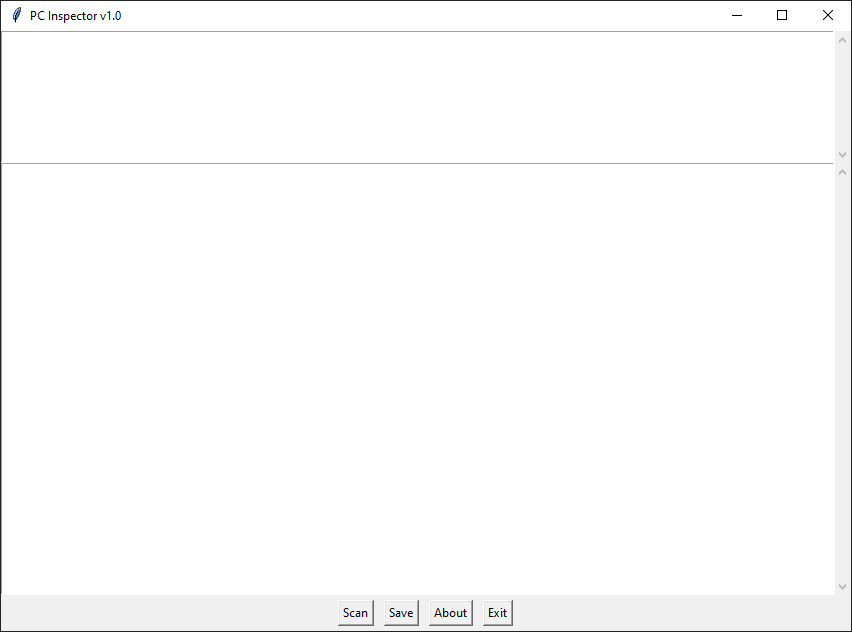
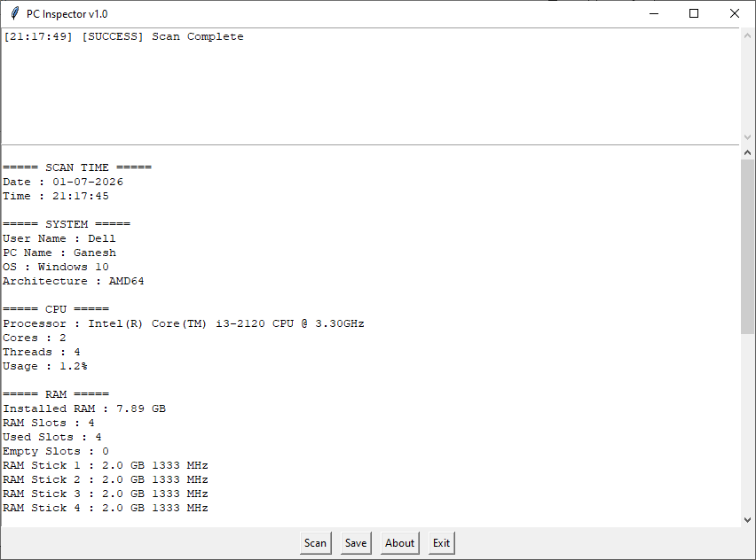

# 🖥️ PC Inspector

A lightweight Windows System Information Tool built with **Python**, **Tkinter**, **WMI**, and **psutil**.

PC Inspector helps you quickly view important hardware and system information from a clean graphical interface and save the results as a text report.

---

## ✨ Features

- 👤 User Name
- 💻 Device Name
- 🏢 Motherboard Model
- ⚙️ Processor Information
- 🧠 Installed RAM
- 📦 RAM Slot Details
- 💾 Storage Information
  - SSD/HDD Detection
  - Drive Model
  - Drive Size
- 🎮 GPU Information
- 🔥 BIOS Version
- 🌐 MAC Address
- 📅 Scan Date & Time
- 💾 Save Report (.txt)
- 📋 Live Log Window

---

## 📸 Screenshots

### Main Window



### Scan Result



---

## 📦 Requirements

- Windows 10 / Windows 11
- Python 3.12+

Install dependencies:

```bash
pip install -r requirements.txt
```

---

## ▶️ Run

```bash
python main.py
```

---

## 📁 Project Structure

```
PC_Inspector/
│
├── export.py
├── gui.py
├── logger.py
├── main.py
├── system_info.py
├── requirements.txt
├── README.md
├── LICENSE
├── .gitignore
│
└── screenshots/
    ├── main_window.png
    └── scan_result.png
```

---

## 💾 Save Report

PC Inspector can export all collected system information into a `.txt` file.

The report is automatically named using the computer name.

Example:

```
Device_Name.txt
```

---

## 🚀 Future Plans

- System Health Monitoring
- Network Information
- Installed Software List
- Windows Activation Status
- One-click System Report
- Dark Theme
- Automatic Update Checker

---

## 👨‍💻 Developer

**Ganesh Pawar**

GitHub:
https://github.com/ganeshpawar5070

---

## 📜 License

This project is licensed under the MIT License.

---

## ⭐ Support

If you like this project, consider giving it a ⭐ on GitHub.

It helps others discover the project and motivates future development.
